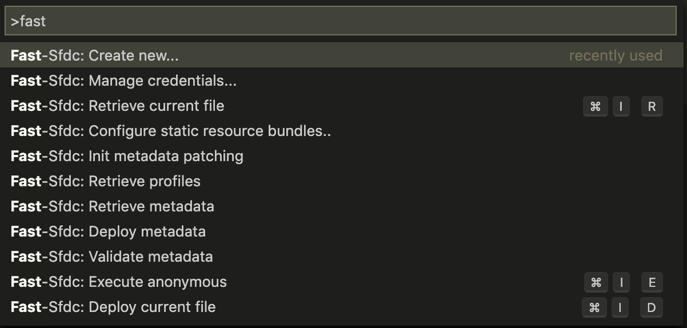

# fast-sfdc README

Standalone VSCode extension for fast development in the salesforce.com platform.
Built from scratch, no jsforce/salesforceDX dependencies, <b>LIGHTNING FAST!</b> ⚡️

## Features

### Deploy, Retrieve, Validate & Compile
Canonical deployment and retrieval of metadata based on your package.xml configuration is fully featured, but you can also deploy or retrieve single files/folders!
Compile on save for apex classes, visualforce pages, triggers, visualforce components, aura bundles and <b>lightning web components</b> is supported!

### Metadata Creation
Straightforward metadata creation and deployment for apex classes, visualforce pages & components, triggers, aura bundles, LWC.

### Metadata Patching

`fast-sfdc` uses [sfdy](https://www.npmjs.com/package/sfdy) as the engine to deploy and retrieve metadata. Thanks to that, it supports a bunch of useful metadata patches (see [here](https://github.com/micheletriaca/sfdy#apply-standard-patches-to-metadata-after-retrieve))

To setup a `.sfdy.json` config in your project, just open the command palette and type `Fast-Sfdc: Init metadata patching`

### Multi-org support
Store different credentials for fast org-switch and deploy when needed or in a hurry!

### 🔥 Lightning Web Components 🔥
<b>Full support for lightning web components</b>: from their creation to their deployment!

### Execute Anonymous
Run your code snippets directly from vscode. Buggy developer console is now a distant memory.

### Run tests
Just open a test class and click on the codelen

## Known Issues

None at the moment.
Please open an issue in the github repository!

## Release Notes

### 1.1.0
Initial release.